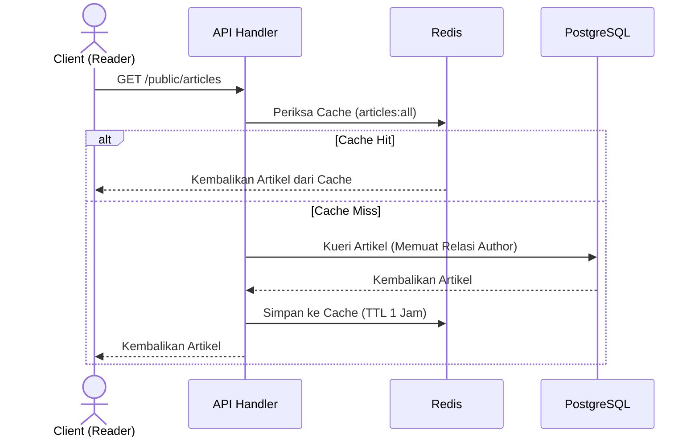
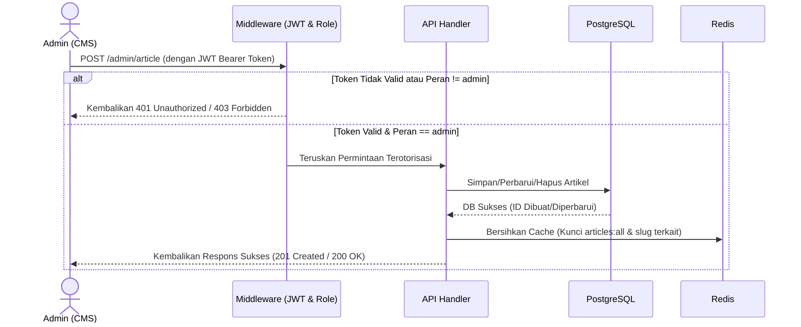

# Go News API - Dokumentasi Pengembang

Baca ini dalam [Bahasa Inggris](README.md)

Selamat datang di dokumentasi pengembang untuk **Go News API**. Dokumen ini ditulis khusus untuk memudahkan pengembangan di masa mendatang, proses onboarding pengembang baru, serta pemeliharaan kode. Dokumentasi ini berfokus pada detail teknis, arsitektur sistem, skema database, mekanisme caching, dan panduan untuk memperluas fitur aplikasi.

---

## Struktur Proyek & Navigasi

Basis kode ini menggunakan struktur Clean Architecture yang rapi. Berikut adalah direktori utama dan file entri penting:

- **[main.go](file:///c:/Users/ranis/Project/work/go-news-api/main.go)**: Bootstrapper aplikasi. Mengatur inisialisasi environment, auto-migrasi database, inisialisasi client cache, wiring dependency injection, dan menjalankan HTTP server.
- **[config/](file:///c:/Users/ranis/Project/work/go-news-api/config)**: Konfigurasi dan inisialisasi driver:
  - [config/env.go](file:///c:/Users/ranis/Project/work/go-news-api/config/env.go): Memuat dan melakukan parsing file `.env`.
  - [config/gorm_postgresql.go](file:///c:/Users/ranis/Project/work/go-news-api/config/gorm_postgresql.go): Menyiapkan koneksi database PostgreSQL menggunakan GORM beserta konfigurasi pool-nya.
  - [config/redis.go](file:///c:/Users/ranis/Project/work/go-news-api/config/redis.go): Menginisialisasi koneksi client Redis dan melakukan verifikasi ping.
- **[internal/domain/](file:///c:/Users/ranis/Project/work/go-news-api/internal/domain)**: Logika bisnis inti yang dibagi per domain, berisi model skema, DTO, repositori, servis, dan handler:
  - **[internal/domain/user/](file:///c:/Users/ranis/Project/work/go-news-api/internal/domain/user)**: Registrasi, login, model data pengguna, dan database seeder admin.
  - **[internal/domain/article/](file:///c:/Users/ranis/Project/work/go-news-api/internal/domain/article)**: Operasi CRUD artikel, pemetaan DTO, seeder artikel dummy, dan integrasi cache Redis.
- **[internal/middleware/](file:///c:/Users/ranis/Project/work/go-news-api/internal/middleware)**: Interseptor HTTP Gin:
  - [auth.go](file:///c:/Users/ranis/Project/work/go-news-api/internal/middleware/auth.go): Mengimplementasikan verifikasi JWT dan penegakan peran (role verification).
- **[internal/utils/](file:///c:/Users/ranis/Project/work/go-news-api/internal/utils)**: Fungsi pembantu umum:
  - [jwt.go](file:///c:/Users/ranis/Project/work/go-news-api/internal/utils/jwt.go): Berfungsi untuk pembuatan (signing) token JWT.
- **[routes/](file:///c:/Users/ranis/Project/work/go-news-api/routes)**: Konfigurasi routing HTTP.
  - [routes/routes.go](file:///c:/Users/ranis/Project/work/go-news-api/routes/routes.go): Menghubungkan endpoint API ke handler terkait dan mendefinisikan aturan CORS.
- **[docs/](file:///c:/Users/ranis/Project/work/go-news-api/docs)**: Dokumentasi eksternal dan koleksi pengujian API.
  - [docs/go-news-api.postman_collection.json](file:///c:/Users/ranis/Project/work/go-news-api/docs/go-news-api.postman_collection.json): Berkas koleksi Postman untuk pengujian API.

---

## Arsitektur Teknis & Aliran Permintaan (Request Flow)

Aplikasi ini menggunakan pola **Clean Architecture** untuk memisahkan tanggung jawab (separation of concerns) ke dalam 4 lapisan:

1. **Model Domain & DTO**: Struktur data murni yang mendefinisikan skema database dan format permintaan/respons API.
2. **Lapisan Repositori (Repository)**: Membungkus operasi database menggunakan GORM, mengisolasi kueri SQL/engine DB dari modul lainnya.
3. **Lapisan Layanan (Service)**: Mengimplementasikan logika bisnis inti aplikasi serta kebijakan manipulasi data dan caching.
4. **Lapisan Handler (Controller)**: Menangani ekstraksi permintaan HTTP, validasi payload JSON menggunakan binding tag Gin, dan pengembalian kode status HTTP beserta format respons.

### Siklus Hidup Permintaan HTTP (End-to-End)

Agar sistem lebih mudah dipahami oleh pengembang, siklus hidup permintaan HTTP dibagi menjadi dua alur yang disederhanakan:

#### 1. Aliran Permintaan Baca Publik (Pola Cache-Aside)
Alur ini digunakan saat mengambil artikel. Jika data sudah di-cache di Redis, respons akan segera dikembalikan untuk menghindari kueri langsung ke database PostgreSQL.



#### 2. Aliran Permintaan Tulis Admin Terautentikasi (Otorisasi & Invalidasi Cache)
Alur ini dipicu saat melakukan mutasi data artikel. Alur ini memvalidasi kredensial pengguna dan secara otomatis menghapus data cache yang usang.



---

## Skema Database & Serialisasi Kustom

Tabel relasional dikelola secara otomatis menggunakan fitur **GORM AutoMigrate** di dalam berkas [main.go](file:///c:/Users/ranis/Project/work/go-news-api/main.go).

### 1. Entitas User ([user/model.go](file:///c:/Users/ranis/Project/work/go-news-api/internal/domain/user/model.go))
Menyimpan informasi pengguna/admin. Mendukung fitur penghapusan logis (soft delete):
- `ID` (Primary Key, uint)
- `Name` (varchar(100), tidak null)
- `Email` (varchar(150), unik, indeks, tidak null)
- `Password` (varchar(255), tidak null) - Disimpan dalam bentuk hash Bcrypt.
- `Role` (varchar(50), default 'user', tidak null) - Menentukan tingkat otorisasi RBAC (`admin` atau `user`).
- `CreatedAt`, `UpdatedAt` (timestamptz)
- `DeletedAt` (indeks timestamptz) - GORM soft delete support.

### 2. Entitas Article ([article/model.go](file:///c:/Users/ranis/Project/work/go-news-api/internal/domain/article/model.go))
Menyimpan data dokumen artikel berita.
- `ID` (Primary Key, uint)
- `Title` (varchar(255), tidak null)
- `Slug` (varchar(255), unik, indeks, tidak null)
- `Summary` (text, tidak null)
- `Category` (varchar(100), tidak null)
- `ReadTime` (varchar(50), tidak null)
- `AuthorID` (uint, foreign key mengarah ke `users(id)`)
- `Content` (`[]map[string]interface{}`, tipe kolom `jsonb`, terindeks GIN)
- `CreatedAt`, `UpdatedAt` (timestamptz)
- `DeletedAt` (indeks timestamptz)

#### Serialisasi Konten Dinamis (Dynamic Content Serialization)
Salah satu fitur teknis utama dari modul artikel ini terletak pada kolom `Content`:
```go
Content []map[string]interface{} `gorm:"serializer:json;type:jsonb;index:,type:gin;not null"`
```
- **Proses Serialisasi**: GORM secara otomatis melakukan *marshal* (konversi dari Go slice ke teks string JSON) saat operasi tulis, dan *unmarshal* (kembali menjadi Go data structure `[]map[string]interface{}`) saat operasi baca.
- **Tipe Data Database**: Kolom menggunakan tipe data asli PostgreSQL `jsonb` yang sangat optimal dalam penyimpanan data JSON biner. Fitur ini memungkinkan penyimpanan data blok editor modern (seperti Editor.js atau Quill editor).
- **Pengindeksan**: Dibuat indeks **GIN** (Generalized Inverted Index) di PostgreSQL pada kolom `Content`, memastikan kueri pencarian data bersarang (nested JSON) tetap sangat cepat.

---

## Mekanisme Caching Redis & Invalidasi Cache

Untuk menahan beban kueri saat lalu lintas padat, endpoint publik mengimplementasikan pola **Cache-Aside (Lazy Loading)**.

### Konfigurasi Cache
- **Masa Aktif (TTL)**: 1 Jam (`cacheTTL` di dalam berkas [article/cache.go](file:///c:/Users/ranis/Project/work/go-news-api/internal/domain/article/cache.go)).
- **Kebijakan Kunci (Keys)**:
  - `articles:all`: Menyimpan seluruh daftar artikel yang ditayangkan ke publik.
  - `article:slug:<slug>`: Menyimpan detail artikel tunggal berdasarkan slug uniknya.

### Kebijakan Invalidasi Cache
Untuk mencegah pembacaan data basi (stale data), operasi penulisan data (mutasi) wajib menghapus cache yang terpengaruh. Berikut adalah aturan penghapusan cache yang diimplementasikan di [article/cache.go](file:///c:/Users/ranis/Project/work/go-news-api/internal/domain/article/cache.go#L35-L42):

| Operasi Tulis | Endpoint Terkait | Kunci Cache yang Dihapus | Alasan & Rationale |
|---|---|---|---|
| **Create (Buat)** | `POST /admin/article` | `articles:all` | Daftar artikel di publik telah berubah dan harus dimuat ulang dari database pada request berikutnya. |
| **Update (Perbarui)** | `PUT /admin/article/:id` | `articles:all`<br>`article:slug:<old_slug>`<br>`article:slug:<new_slug>` | Daftar artikel berubah. Jika pengembang/admin mengubah slug artikel, sistem akan membersihkan cache dari slug lama dan slug baru agar tidak terjadi eror 404 cache. |
| **Delete (Hapus)** | `DELETE /admin/article/:id` | `articles:all`<br>`article:slug:<slug>` | Daftar publik berubah; detail cache dari artikel yang dihapus segera disingkirkan agar tidak bisa diakses kembali. |

---

## Autentikasi, Otorisasi, & RBAC

API ini menggunakan mekanisme **Stateless JWT Tokens** untuk keamanan rute.

### 1. Struktur Token
- Token dibuat melalui berkas pembantu [utils/jwt.go](file:///c:/Users/ranis/Project/work/go-news-api/internal/utils/jwt.go).
- Menyimpan klaim kustom: `UserID` dan `Role`.
- Ditandatangani menggunakan algoritma enkripsi simetris `HS256` dengan kunci rahasia yang diambil dari variabel environment `JWT_SECRET`.
- Masa kedaluwarsa token: 24 Jam.

### 2. Aliran Interseptor Rute
- **[AuthMiddleware](file:///c:/Users/ranis/Project/work/go-news-api/internal/middleware/auth.go#L13)**: Mengadang permintaan ke rute terproteksi, membaca header `Authorization` dengan format `Bearer <token>`, memverifikasi keabsahan JWT, dan mengekstrak klaim user. Jika token valid, informasi `user_id` dan `role` disimpan ke dalam konteks permintaan Gin (`c.Set("user_id", ...)` dan `c.Set("role", ...)`).
- **[RoleMiddleware](file:///c:/Users/ranis/Project/work/go-news-api/internal/middleware/auth.go#L53)**: Memeriksa data `role` yang tersimpan pada konteks Gin. Membandingkannya dengan daftar peran yang diperbolehkan mengakses rute (contoh: `RoleMiddleware("admin")`).

---

## Konfigurasi Lingkungan (Environment) & Menjalankan Aplikasi

### 1. Konfigurasi Variabel (`.env`)
Salin file `.env.example` menjadi `.env` di direktori utama proyek, kemudian sesuaikan nilainya:
```ini
DB_HOST=localhost
DB_USER=postgres
DB_PASS=isi_password_database_anda
DB_NAME=news_db
DB_PORT=5432
DB_SSLMODE=disable

REDIS_HOST=localhost
REDIS_PORT=6379
REDIS_PASSWORD=

JWT_SECRET=buat_kunci_rahasia_jwt_yang_panjang_dan_acak
```

### 2. Menjalankan Dependensi Eksternal (Docker)
Jika Anda belum memiliki instance PostgreSQL atau Redis yang berjalan di sistem lokal, gunakan perintah Docker berikut:
```bash
# Menjalankan Redis
docker run --name news-api-redis -p 6379:6379 -d redis

# Menjalankan PostgreSQL (Opsional)
docker run --name news-api-postgres -e POSTGRES_DB=news_db -e POSTGRES_USER=postgres -e POSTGRES_PASSWORD=isi_password_database_anda -p 5432:5432 -d postgres
```

### 3. Perintah Eksekusi
Gunakan perintah Go berikut untuk memproses dependensi dan menjalankan server:
```bash
# Mengunduh dependensi
go mod tidy

# Menjalankan server aplikasi
go run main.go
```
Secara default, HTTP server akan berjalan pada port `8888`. Sinkronisasi tabel database (auto-migration) berjalan otomatis saat inisialisasi aplikasi.

### 4. Akun Admin Bawaan (Admin Seeder)
Saat pertama kali dijalankan, fungsi [RunAdminSeeder](file:///c:/Users/ranis/Project/work/go-news-api/internal/domain/user/seeder.go#L11) di [main.go](file:///c:/Users/ranis/Project/work/go-news-api/main.go) akan memeriksa keberadaan user dengan role `"admin"`. Jika kosong, sistem otomatis membuat satu akun admin default:
- **Email**: `admin@news.com`
- **Password**: `#admin123` *(Penting: Pastikan untuk menyertakan awalan karakter pagar `#` sesuai implementasi pada kode seeder)*

---

## Pengujian API dengan Postman

Tersedia berkas koleksi Postman untuk mempercepat pengujian setiap rute API.

- **Lokasi Berkas**: [docs/go-news-api.postman_collection.json](file:///c:/Users/ranis/Project/work/go-news-api/docs/go-news-api.postman_collection.json)
- **Cara Mengimpor**:
  1. Buka aplikasi client Postman.
  2. Klik tombol **Import** di bagian panel navigasi kiri atas.
  3. Pilih dan unggah berkas `go-news-api.postman_collection.json` dari repositori ini.
  4. Seluruh endpoint API (Registrasi, Login, Rute Publik, dan Rute Manajemen Admin) beserta contoh payload-nya langsung siap digunakan.

---

## Panduan Pengembangan: Cara Memperluas Aplikasi

Gunakan langkah-langkah terstruktur di bawah ini sebagai acuan (cookbook) untuk menambahkan modul atau domain baru (contoh: Menambahkan fitur **Komentar (Comments)** ke artikel):

### Langkah 1: Buat Direktori Domain Baru
Buat folder baru di bawah `internal/domain/`:
```bash
mkdir internal/domain/comment
```

### Langkah 2: Definisikan Model Database
Buat file `internal/domain/comment/model.go` berisi definisi skema GORM:
```go
package comment

import (
	"time"
	"gorm.io/gorm"
)

type Comment struct {
	ID        uint   `gorm:"primaryKey"`
	ArticleID uint   `gorm:"not null"`
	Author    string `gorm:"size:100;not null"`
	Body      string `gorm:"type:text;not null"`
	CreatedAt time.Time
	DeletedAt gorm.DeletedAt `gorm:"index"`
}
```

### Langkah 3: Definisikan Request & Response DTO
Buat file `internal/domain/comment/dto.go` untuk menangani struktur input validasi dan format keluaran API:
```go
package comment

type CreateCommentRequest struct {
	Author string `json:"author" binding:"required,max=100"`
	Body   string `json:"body" binding:"required"`
}

type CommentResponse struct {
	ID        uint   `json:"id"`
	Author    string `json:"author"`
	Body      string `json:"body"`
	CreatedAt string `json:"createdAt"`
}
```

### Langkah 4: Tulis Kontrak Repositori & Implementasinya
Buat file `internal/domain/comment/repo.go` untuk mengisolasi query database GORM:
```go
package comment

import "gorm.io/gorm"

type CommentRepository interface {
	Create(comment *Comment) error
	FindByArticleID(articleID uint) ([]Comment, error)
}

type commentRepository struct {
	db *gorm.DB
}

func NewCommentRepository(db *gorm.DB) CommentRepository {
	return &commentRepository{db: db}
}

func (r *commentRepository) Create(c *Comment) error {
	return r.db.Create(c).Error
}

func (r *commentRepository) FindByArticleID(articleID uint) ([]Comment, error) {
	var comments []Comment
	err := r.db.Where("article_id = ?", articleID).Find(&comments).Error
	return comments, err
}
```

### Langkah 5: Implementasikan Lapisan Bisnis (Service)
Buat file `internal/domain/comment/service.go`. Di bagian ini Anda bisa menambahkan logika validasi bisnis tambahan atau integrasi cache jika diperlukan:
```go
package comment

type CommentService interface {
	AddComment(articleID uint, req CreateCommentRequest) (Comment, error)
	GetCommentsByArticle(articleID uint) ([]Comment, error)
}

type commentService struct {
	repo CommentRepository
}

func NewCommentService(repo CommentRepository) CommentService {
	return &commentService{repo: repo}
}

// Implementasikan method di bawah ini...
```

### Langkah 6: Implementasikan HTTP Handler (Controller)
Buat file `internal/domain/comment/handler.go` untuk memproses binding payload JSON dan respons HTTP:
```go
package comment

import (
	"net/http"
	"strconv"
	"github.com/gin-gonic/gin"
)

type CommentHandler struct {
	service CommentService
}

func NewCommentHandler(service CommentService) *CommentHandler {
	return &CommentHandler{service: service}
}

func (h *CommentHandler) AddComment(c *gin.Context) {
    // 1. Ambil parameter dari rute/kueri
    // 2. Lakukan c.ShouldBindJSON()
    // 3. Panggil method service
    // 4. Kirim respons c.JSON()
}
```

### Langkah 7: Daftarkan Skema & Hubungkan Dependensi (Wiring)
Buka berkas **[main.go](file:///c:/Users/ranis/Project/work/go-news-api/main.go)** dan tambahkan penyesuaian berikut:
1. Daftarkan model baru pada fungsi `AutoMigrate` GORM:
   ```go
   db.AutoMigrate(article.Article{}, user.User{}, comment.Comment{})
   ```
2. Hubungkan dependency injection instans repositori, service, dan handler:
   ```go
   commentRepo := comment.NewCommentRepository(db)
   commentService := comment.NewCommentService(commentRepo)
   commentHandler := comment.NewCommentHandler(commentService)
   ```
3. Oper instans handler baru ke dalam fungsi inisialisasi rute:
   ```go
   router := routes.SetRoutes(env, articleHandler, userHandler, commentHandler)
   ```

### Langkah 8: Konfigurasikan Endpoint Rute API
Buka berkas **[routes/routes.go](file:///c:/Users/ranis/Project/work/go-news-api/routes/routes.go)** untuk mendaftarkan endpoint HTTP rute:
- Contoh mendaftarkan sebagai rute publik pembaca:
  ```go
  publicArticleRoutes.POST("/articles/:id/comments", commentHandler.AddComment)
  ```
