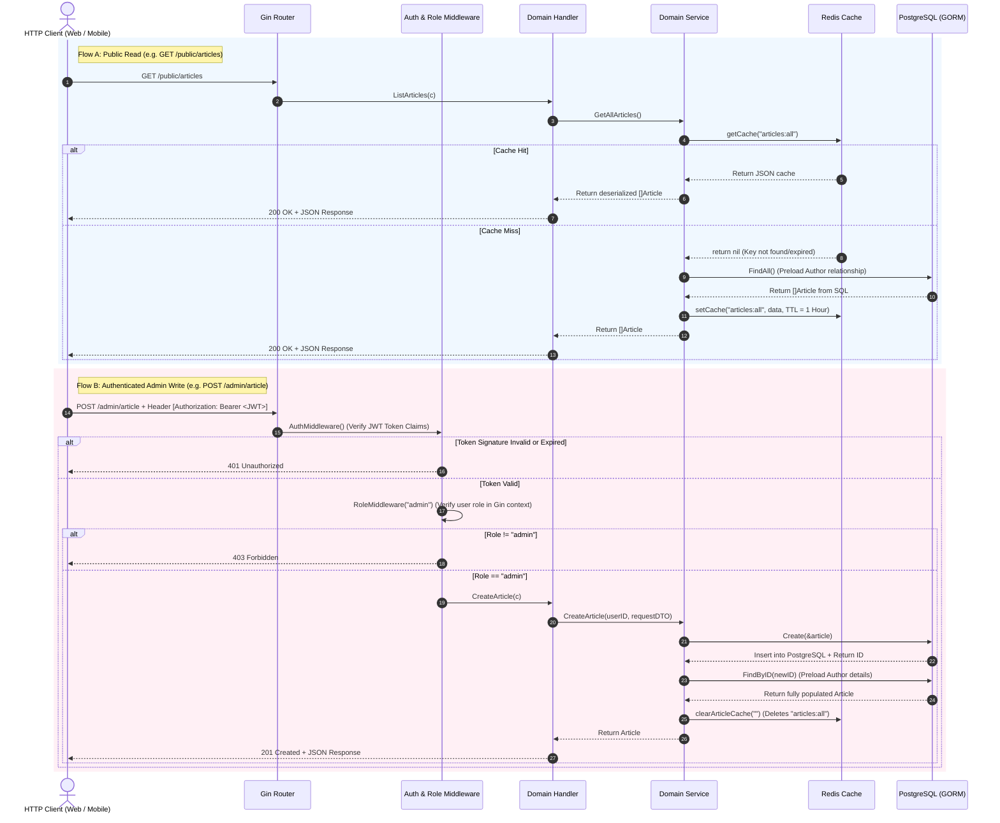

# Go News API - Developer Documentation

Welcome to the developer documentation for the **Go News API**. This document is specifically written to facilitate future development, onboarding, and codebase maintenance. It focuses on technical details, system architecture, database design, caching flows, and extension guidelines.

---

## Project Structure & Navigation

The codebase follows a structured layout. Below are the key directories and entry files:

- **[main.go](file:///c:/Users/ranis/Project/work/go-news-api/main.go)**: The application bootstrapper. Handles environment initialization, database automigration, caching client setup, dependency injection wiring, and server startup.
- **[config/](file:///c:/Users/ranis/Project/work/go-news-api/config)**: Configuration and driver initializations:
  - [config/env.go](file:///c:/Users/ranis/Project/work/go-news-api/config/env.go): Handles `.env` file loading and parsing.
  - [config/gorm_postgresql.go](file:///c:/Users/ranis/Project/work/go-news-api/config/gorm_postgresql.go): Sets up PostgreSQL connection pool constraints using GORM.
  - [config/redis.go](file:///c:/Users/ranis/Project/work/go-news-api/config/redis.go): Initiates and pings the Redis client connection.
- **[internal/domain/](file:///c:/Users/ranis/Project/work/go-news-api/internal/domain)**: Core business sub-domains containing schema models, DTOs, interfaces, and implementations:
  - **[internal/domain/user/](file:///c:/Users/ranis/Project/work/go-news-api/internal/domain/user)**: User registration, login, data models, and database seeder.
  - **[internal/domain/article/](file:///c:/Users/ranis/Project/work/go-news-api/internal/domain/article)**: Article CRUD operations, DTO mappers, seeders, and Redis cache integration.
- **[internal/middleware/](file:///c:/Users/ranis/Project/work/go-news-api/internal/middleware)**: HTTP interceptors:
  - [auth.go](file:///c:/Users/ranis/Project/work/go-news-api/internal/middleware/auth.go): Implements JWT verification and role enforcement.
- **[internal/utils/](file:///c:/Users/ranis/Project/work/go-news-api/internal/utils)**: Generic helpers:
  - [jwt.go](file:///c:/Users/ranis/Project/work/go-news-api/internal/utils/jwt.go): Handles JWT token signing.
- **[routes/](file:///c:/Users/ranis/Project/work/go-news-api/routes)**: HTTP API routing.
  - [routes/routes.go](file:///c:/Users/ranis/Project/work/go-news-api/routes/routes.go): Connects endpoints to handlers and sets up CORS rules.
- **[docs/](file:///c:/Users/ranis/Project/work/go-news-api/docs)**: Documentation and API test collections.
  - [docs/go-news-api.postman_collection.json](file:///c:/Users/ranis/Project/work/go-news-api/docs/go-news-api.postman_collection.json): API test queries.

---

## Technical Architecture & Request Flow

This application is built using **Clean Architecture** patterns, separating concerns into four layers:

1. **Domain Models & DTOs**: Logic-free structures outlining database schemas and request/response shapes.
2. **Repository Layer**: Encapsulates GORM operations, isolating the database engine from the rest of the application.
3. **Service Layer**: Implements pure business rules, handles cache policies, and acts as the orchestrator.
4. **Handler Layer**: Binds input requests, validates payloads using Gin tags, and maps output models.

### End-to-End Request Lifecycle

The diagram below showcases the HTTP execution flow. It illustrates how requests are parsed, validated, routed, cached via the **Cache-Aside** pattern, or authorized via the JWT pipeline.



---

## Database Schemas & Custom Serializers

The relational tables are managed via **GORM AutoMigrate** within [main.go](file:///c:/Users/ranis/Project/work/go-news-api/main.go).

### 1. User Entity ([user/model.go](file:///c:/Users/ranis/Project/work/go-news-api/internal/domain/user/model.go))
Represents the account model. Implements soft deletes and role flags:
- `ID` (Primary Key, uint)
- `Name` (varchar(100), not null)
- `Email` (varchar(150), unique, index, not null)
- `Password` (varchar(255), not null) - stored as a Bcrypt hash.
- `Role` (varchar(50), default 'user', not null) - defines RBAC authorization level (`admin` or `user`).
- `CreatedAt`, `UpdatedAt` (timestamptz)
- `DeletedAt` (timestamptz index) - GORM soft delete support.

### 2. Article Entity ([article/model.go](file:///c:/Users/ranis/Project/work/go-news-api/internal/domain/article/model.go))
Represents an article document.
- `ID` (Primary Key, uint)
- `Title` (varchar(255), not null)
- `Slug` (varchar(255), unique, index, not null)
- `Summary` (text, not null)
- `Category` (varchar(100), not null)
- `ReadTime` (varchar(50), not null)
- `AuthorID` (uint, foreign key to `users(id)`)
- `Content` (`[]map[string]interface{}`, serialized to `jsonb`, GIN indexed)
- `CreatedAt`, `UpdatedAt` (timestamptz)
- `DeletedAt` (timestamptz index)

#### Dynamic Content Serialization
One of the core features of the `Article` model is the `Content` field structure:
```go
Content []map[string]interface{} `gorm:"serializer:json;type:jsonb;index:,type:gin;not null"`
```
- **Serialization**: GORM automatically serializes the Go slice of maps into a JSON string on write, and deserializes it back to `[]map[string]interface{}` on read.
- **Database Engine**: It leverages PostgreSQL's native `jsonb` datatype, allowing the storage of structured block editor outputs (e.g., payloads generated by Quill or Editor.js).
- **Indexing**: A PostgreSQL **GIN** (Generalized Inverted Index) is created on the `Content` field, ensuring that queries filtering nested JSON blocks remain highly performant.

---

## Redis Caching & Invalidation Logic

To handle large traffic peaks, public endpoints implement a **Cache-Aside (Lazy Loading)** cache strategy.

### Cache Details
- **TTL (Time to Live)**: 1 Hour (`cacheTTL` in [article/cache.go](file:///c:/Users/ranis/Project/work/go-news-api/internal/domain/article/cache.go)).
- **Key Policies**:
  - `articles:all`: Stores the complete catalog of articles returned to the public list endpoint.
  - `article:slug:<slug>`: Stores a specific article object mapped to its unique URL slug.

### Invalidation Constraints
To prevent stale reads, data mutations in the write path must explicitly purge affected keys. This is implemented inside [article/cache.go](file:///c:/Users/ranis/Project/work/go-news-api/internal/domain/article/cache.go#L35-L42):

| Action | Affected Endpoint API | Cache Keys Purged | Rationale |
|---|---|---|---|
| **Create** | `POST /admin/article` | `articles:all` | The list has changed; it must be re-fetched. No specific slug cache to clear yet. |
| **Update** | `PUT /admin/article/:id` | `articles:all`<br>`article:slug:<old_slug>`<br>`article:slug:<new_slug>` | Clearing lists. If the editor updated the slug, both old and new slug caches are purged to prevent orphaned keys and 404 cache responses. |
| **Delete** | `DELETE /admin/article/:id` | `articles:all`<br>`article:slug:<slug>` | List is updated; the detail cache of the deleted item is evicted to prevent ghost reads. |

---

## Authentication, Authorization & RBAC

The API uses **Stateless JWT Tokens** for session verification.

### 1. Token Signature
- Generated in [utils/jwt.go](file:///c:/Users/ranis/Project/work/go-news-api/internal/utils/jwt.go).
- Contains custom claims: `UserID` and `Role`.
- Encrypted using `HS256` symmetric signing key defined by the `JWT_SECRET` environment variable.
- Lifetime: 24 Hours.

### 2. Guard Pipeline
- **[AuthMiddleware](file:///c:/Users/ranis/Project/work/go-news-api/internal/middleware/auth.go#L13)**: Intercepts the request, checks for `Authorization` header starting with `Bearer `, validates the JWT token, and parses the claims. If verified, it calls `c.Set("user_id", claims.UserID)` and `c.Set("role", claims.Role)` to populate the request context.
- **[RoleMiddleware](file:///c:/Users/ranis/Project/work/go-news-api/internal/middleware/auth.go#L53)**: Inspects the `role` saved in the context. Checks it against the list of permitted roles passed to the middleware setup (e.g., `RoleMiddleware("admin")`).

---

## Environment Setup & Initial Launch

### 1. Configuration Keys (`.env`)
Create a `.env` file at the root. Use the variables listed below:
```ini
DB_HOST=localhost
DB_USER=postgres
DB_PASS=your_db_password
DB_NAME=news_db
DB_PORT=5432
DB_SSLMODE=disable

REDIS_HOST=localhost
REDIS_PORT=6379
REDIS_PASSWORD=

JWT_SECRET=your_long_random_jwt_secret_key_here
```

### 2. Bootstrapping Services (Docker)
If you don't have Redis or PostgreSQL running locally, run them via Docker:
```bash
# Start Redis Cache
docker run --name news-api-redis -p 6379:6379 -d redis

# Start PostgreSQL Database (Optional)
docker run --name news-api-postgres -e POSTGRES_DB=news_db -e POSTGRES_USER=postgres -e POSTGRES_PASSWORD=your_db_password -p 5432:5432 -d postgres
```

### 3. Startup Commands
Run the command below to resolve imports and start the HTTP engine:
```bash
# Get dependencies
go mod tidy

# Run application
go run main.go
```
The server will start on port `8888`. Database schemas are automatically synchronized on startup.

### 4. Admin Seeder Credentials
Upon launch, [main.go](file:///c:/Users/ranis/Project/work/go-news-api/main.go) triggers [RunAdminSeeder](file:///c:/Users/ranis/Project/work/go-news-api/internal/domain/user/seeder.go#L11). If no user with the role `"admin"` exists in the database, it creates a default administrator:
- **Email**: `admin@news.com`
- **Password**: `#admin123` *(Note: Make sure to use the hash prefix `#`, as documented in the seeder code)*

---

## API Testing with Postman

To simplify endpoint testing, a Postman Collection is available in the repository.

- **File Path**: [docs/go-news-api.postman_collection.json](file:///c:/Users/ranis/Project/work/go-news-api/docs/go-news-api.postman_collection.json)
- **Import Instructions**:
  1. Open your Postman desktop client.
  2. Click **Import** in the upper-left navigation panel.
  3. Choose and upload the `go-news-api.postman_collection.json` file.
  4. The collection contains sample requests for registration, login, public article reads, and admin mutations (with automatic bearer token handling if configured).

---

## Onboarding Cookbook: How to Extend the Codebase

To add a new feature or domain resource (e.g., adding **Comments** to articles), follow these structured steps:

### Step 1: Create the Domain Directory
Create a new directory under `internal/domain/`:
```bash
mkdir internal/domain/comment
```

### Step 2: Define the Database Model
Create `internal/domain/comment/model.go` containing the GORM schema struct.
```go
package comment

import (
	"time"
	"gorm.io/gorm"
)

type Comment struct {
	ID        uint   `gorm:"primaryKey"`
	ArticleID uint   `gorm:"not null"`
	Author    string `gorm:"size:100;not null"`
	Body      string `gorm:"type:text;not null"`
	CreatedAt time.Time
	DeletedAt gorm.DeletedAt `gorm:"index"`
}
```

### Step 3: Define Request and Response DTOs
Create `internal/domain/comment/dto.go` to handle request validation binding tags:
```go
package comment

type CreateCommentRequest struct {
	Author string `json:"author" binding:"required,max=100"`
	Body   string `json:"body" binding:"required"`
}

type CommentResponse struct {
	ID        uint   `json:"id"`
	Author    string `json:"author"`
	Body      string `json:"body"`
	CreatedAt string `json:"createdAt"`
}
```

### Step 4: Write the Repository Interface & GORM implementation
Create `internal/domain/comment/repo.go` to isolate GORM queries:
```go
package comment

import "gorm.io/gorm"

type CommentRepository interface {
	Create(comment *Comment) error
	FindByArticleID(articleID uint) ([]Comment, error)
}

type commentRepository struct {
	db *gorm.DB
}

func NewCommentRepository(db *gorm.DB) CommentRepository {
	return &commentRepository{db: db}
}

func (r *commentRepository) Create(c *Comment) error {
	return r.db.Create(c).Error
}

func (r *commentRepository) FindByArticleID(articleID uint) ([]Comment, error) {
	var comments []Comment
	err := r.db.Where("article_id = ?", articleID).Find(&comments).Error
	return comments, err
}
```

### Step 5: Implement the Business Service
Create `internal/domain/comment/service.go`. The service can take Redis dependencies if caching comments is necessary:
```go
package comment

type CommentService interface {
	AddComment(articleID uint, req CreateCommentRequest) (Comment, error)
	GetCommentsByArticle(articleID uint) ([]Comment, error)
}

type commentService struct {
	repo CommentRepository
}

func NewCommentService(repo CommentRepository) CommentService {
	return &commentService{repo: repo}
}

// Implement methods...
```

### Step 6: Define HTTP Controllers (Handlers)
Create `internal/domain/comment/handler.go` to bind and return HTTP JSON responses:
```go
package comment

import (
	"net/http"
	"strconv"
	"github.com/gin-gonic/gin"
)

type CommentHandler struct {
	service CommentService
}

func NewCommentHandler(service CommentService) *CommentHandler {
	return &CommentHandler{service: service}
}

func (h *CommentHandler) AddComment(c *gin.Context) {
    // 1. Get query params/parameters
    // 2. c.ShouldBindJSON()
    // 3. Call service
    // 4. Return c.JSON()
}
```

### Step 7: Inject Dependencies and Register Schemas
Open **[main.go](file:///c:/Users/ranis/Project/work/go-news-api/main.go)** and update the following:
1. Add the new model to the GORM `AutoMigrate` call:
   ```go
   db.AutoMigrate(article.Article{}, user.User{}, comment.Comment{})
   ```
2. Wire up the repository, service, and handler objects:
   ```go
   commentRepo := comment.NewCommentRepository(db)
   commentService := comment.NewCommentService(commentRepo)
   commentHandler := comment.NewCommentHandler(commentService)
   ```
3. Pass the new handler into your route initialization function:
   ```go
   router := routes.SetRoutes(env, articleHandler, userHandler, commentHandler)
   ```

### Step 8: Configure Endpoints
Open **[routes/routes.go](file:///c:/Users/ranis/Project/work/go-news-api/routes/routes.go)** and register the route handler. 
- For public reader actions:
  ```go
  publicArticleRoutes.POST("/articles/:id/comments", commentHandler.AddComment)
  ```
